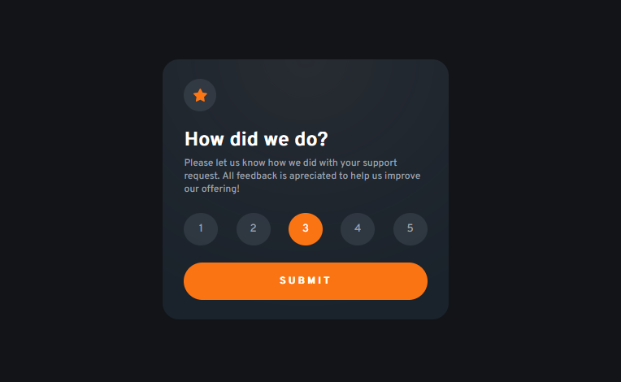

# Interactive Rating - Challange Front End Mentor

## Sobre o desafio

O desafio é construir esse componente de classificação interativa e deixá-lo o mais próximo possível do design.

Você pode usar qualquer ferramenta que desejar para ajudá-lo a concluir o desafio. Portanto, se você tem algo que gostaria de praticar, sinta-se à vontade para tentar.

Seus usuários devem ser capazes de:
- Selecione e envie uma classificação numérica;
- Veja o estado do cartão de "obrigado" depois de enviar uma avaliação;
- Veja os estados de focalização e foco para todos os elementos interativos na página.

[- Challenge link](https://www.frontendmentor.io/challenges/interactive-rating-component-koxpeBUmI)

## 🚀 Tecnologias utilizadas

- HTML e CSS
- JavaScript
- Git e Github

[💻 Live Preview](https://challange-interactiverating.netlify.app/)

---
Made with &#128151; by [Eriralf Barros.](https://www.linkedin.com/in/eriralfbarros/)